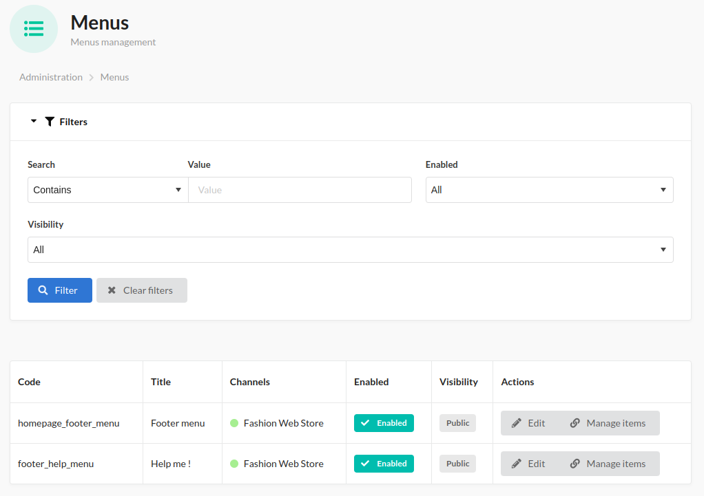

[](https://github.com/wemea-fr/SyliusMenuPlugin/blob/main/LICENSE.txt)
[](https://github.com/wemea-fr/SyliusMenuPlugin/actions/workflows/build.yml)
[](https://packagist.org/packages/wemea/sylius-menu-plugin)
[](https://packagist.org/packages/wemea/sylius-menu-plugin)

<p align="center">
    <a href="https://www.wemea.fr" target="_blank">
        
    </a>
</p>
<h1 align="center">Sylius Menu Plugin</h1>

<p align="center">Plugin allow to manage Shop menus from the Back Office</p>

## Features:

- Create/Delete menu with commands :
    - `wemea:menu:create <code>`
    - `wemea:menu:delete <code>`
- Manage visibility of menus
- Manage menu item (link, title, description, order/priority, icon)
- Default link types :
    - Custom: put any link inside
    - Product: choose link to a product and path is generated dynamically
    - Taxon: choose link to a taxononmy and path is generated dynamically





## Summary

1. [Installation](#installation)
2. [Usage](#usage)
    1. [Add new menu](#add-a-menu)
    2. [Change default route mapping](#change-default-resource-route-mapping)
    3. [Add Custom resource link](#add-new-link-type-to-another-resource)
3. [Use menu fixtures](#use-menu-fixtures)

## Installation

1. Require plugin with composer:

    ```bash
    composer require wemea/sylius-menu-plugin
    ```

2. Add followings to your `config/bundles.php` if not already automatically added:

    ```php
    Wemea\SyliusMenuPlugin\WemeaSyliusMenuPlugin::class => ['all' => true],
    ```

3. Import config in your `config/packages/_sylius.yaml`:

   ```yaml
   imports:
       [...]
       - { resource: "@WemeaSyliusMenuPlugin/Resources/config/app/config.yml" }
   ```

4. Import routes in your `config/routes.yml`:

   ```yaml
    wemea_menu_routing:
      resource: "@WemeaSyliusMenuPlugin/Resources/config/routing.yml"
   ```

5. Add menus into your template. Check [Usage - Add a menu](#add-a-menu) for more information

6. Run [integration test](#running-plugin-integration-tests-only).

   :warning: There are integration tests only for admin part. **You should** add your owned tests for shop part.


## Usage

### Add a menu

*Tips* :
> Menus can only be created and removed with Symfony command to avoid shop admin removed accidentally a menu and block the UI. Menus can be disabled on the BO.

1. Create new menu

   Run `bin/console wemea:menu:create <your_menu_code>`

   You can run `bin/console wemea:menu:create --help` to view available options

2. Add this menu in your template: add this where you want to introduce menu to your page(s)
    ```twig
        {{ render(controller('wemea_sylius_menu.controller.render_menu::renderAction', {
               'code': '<your_menu_code>'
        })) }}
    ```
   By default, the menu use `@WemeaSyliusMenuPlugin/Shop/Menu/_default.html.twig`. If you want to use your own template, add tempalte option on render :

   ```twig
           {{ render(controller('wemea_sylius_menu.controller.render_menu::renderAction', {
                  'code': '<your_menu_code>',
                   'template': '@App/your/menu/template.html.twig'
           })) }}
   ```
3. Add behat test to check menu integration

   You can view full integration on [this file](./tests/Application/templates/bundles/SyliusShopBundle/Layout/Footer/Grid/_your_store.html.twig) and test on [this folder](features/shop)

### Change default resource route mapping

If you change defaults routes of application, you need to change route mapping of link resources. You can do it on `config/packages/wemea_sylius_menu.yml` with this configuration :

```yaml
## Default configuration
wemea_sylius_menu:
  resource_path_resolver_configuration:

    custom:
      # route is null for custom type because is not use the router resolver 
      route: null 
      parameters: []

    product:
      route: 'sylius_shop_product_show'
      parameters:
        slug: 'getSlug'
    
    taxon:
      route: 'sylius_shop_product_index'
      parameters:
        slug: 'getSlug'
```

Parameters node is an associative array between route parameter and the method name to access at the resource property

### Add new link type to another resource

This plugin allows creating new resource link. You may need it to redirect on custom resource (like brand, we use this example for instruction example)

1. Override the default MenuLink entity:
    ```php
    <?php
    
    declare(strict_types=1);
    
    namespace App\Entity;
    use Doctrine\ORM\Mapping as ORM;
    use Wemea\SyliusMenuPlugin\Entity\MenuLink as BaseMenuLink;

    /**
     * @ORM\Entity
     * @ORM\Table(name="wemea_menu_link")
     */
    class MenuLink extends BaseMenuLink
    {
        //Add your new property
        /** 
         * @var Brand|null $brand 
         * @ORM\ManyToOne(targetEntity="Brand")
         * @ORM\JoinColumn(name="brand_id", referencedColumnName="id")
         */
        protected $brand;
    
        //add this property name to know properties
        public static function getLinkProperties() : array{
            return array_merge(
                parent::getLinkProperties(),
                ['brand'] // your property name
            ); 
        }
    }
    ```
2. Declare this entity as resource model into `config/packages/_sylius.yml`
    ```yaml
    sylius_resource:
      resources:
         wemea_sylius_menu.menu_link:
              classes:
                model: App\Entity\MenuLink
    ```

3. Add form extension for `Wemea\SyliusMenuPlugin\Form\Type\MenuLinkType` with (autocomplete ?) choice type. Check [official documentation](https://symfony.com/doc/current/form/create_form_type_extension.html) create form extension.

   This field should **NOT** be mapped
    ```php
           $builder
               ->add('brand', BrandAutocompleteChoiceType::class, [
                           'mapped' => false,
               ]);
    ```
   This new field is automatically add to template. By default, it uses : `{{ form_row(form.brand) }}`.

   If you want use a custom template, you can create `templates/bundles/WemeaSyliusMenuPlugin/Admin/MenuLink/Form/Fields/_<field_name>.html.twig` and use field with the property `form`.

4. Add routing configuration on `config/packages/wemea_sylius_menu.yml`
    ```yaml
    wemea_sylius_menu:
      resource_path_resolver_configuration:
         # Use property name as key
         brand:
          route: 'app_shop_brand_show' 
          parameters: [
           'code' => 'getCode'
           ]
    ```
5. Clear cache and make migration to update schema

## Use menu fixtures

If you need to load menu programmatically, you can use menu fixture like it :
```yaml
sylius_fixtures:
  suites:

    <suite_name>:
      fixtures:

        menu:
          name: menu
          options:
            custom:

              -   code: <menu_code>
                  visibility: public  # use private or public value (is public by default)
                  enabled: true       # menu is enabled by default
                  
                  #Transltion accept associative array of [locale => [title => <expected title> ]] 
                  translations:
                    en_US:
                      title: The title
                  
                  #channels is array of channels code
                  channels: ['FASHION_WEB']
                  
                  #Define items of menu
                  items:
                    - target: _self # target accept _self or _blank. By default is _self
                      
                      #Transaltions is defined like menu translation with 'description' optional node
                      translations: 
                        en_US:
                          title: <title>
                          description: <description>
          
                      # link node allow to defined the target resource of menu item 
                      link:
              
                        # for a custom link, use associative array of locale => path
                        custom_link:
                          en_US: /the/expected/path
                        
                        # for a product link use the code of target product
                        product_code: <product_code>
                        
                        # for a taxon link use the code of target product
                        taxon_code: <taxon_code>
```
To see a full implementation example, you can check the file [footer_help_menu.yaml](./tests/Application/config/fixtures/defaults_menus/footer_help_menu.yaml).

## Issues / Remaining work

* Add fixtures for Menu item images
* Add possibility to add an anchor as custom link
* Manage resolve path according current locale for custom links in the case where store use localized URL
